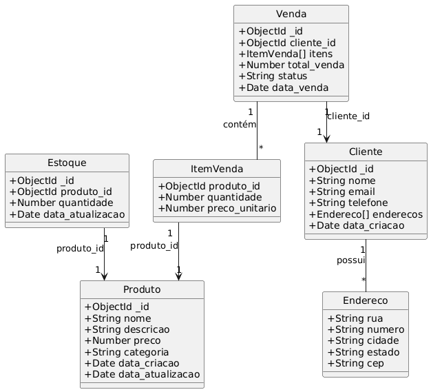

# DNCommerce - Sistema de Gerenciamento de Estoque e Vendas

## Descrição do Projeto

DNCommerce é uma loja online de produtos de beleza que necessita de um sistema backend para gerenciar o cadastro de produtos, clientes, controle de estoque e registro de vendas. Este projeto implementa uma API RESTful utilizando Node.js, Express e MongoDB para atender a essas necessidades, permitindo operações eficientes de CRUD e integração entre as entidades do sistema.

## Tecnologias Utilizadas

- Node.js
- Express.js
- MongoDB com Mongoose
- dotenv para variáveis de ambiente
- Bash e PowerShell para scripts de teste

## Modelagem de Dados

O sistema possui as seguintes entidades principais modeladas com Mongoose:

- **Produto**: nome, descrição, preço, categoria, datas de criação e atualização.
- **Cliente**: nome, email, telefone, endereços (rua, número, cidade, estado, cep), data de criação.
- **Venda**: referência ao cliente, itens (produto, quantidade, preço unitário), total da venda, status e data da venda.
- **Estoque**: referência ao produto, quantidade disponível e data da última atualização.

Abaixo está o diagrama do modelo de dados que representa as relações entre as entidades:



## Design da API REST

A seguir estão as rotas da API REST para gerenciar os recursos do sistema.

### Rotas de Produtos

| Método HTTP | Rota                | Descrição                                 |
|-------------|---------------------|-------------------------------------------|
| `GET`       | `/produtos`         | Lista todos os produtos.                  |
| `GET`       | `/produtos/{id}`    | Obtém um produto específico pelo ID.      |
| `POST`      | `/produtos`         | Cria um novo produto.                     |
| `PUT`       | `/produtos/{id}`    | Atualiza um produto existente pelo ID.    |
| `DELETE`    | `/produtos/{id}`    | Deleta um produto pelo ID.                |

### Rotas de Clientes

| Método HTTP | Rota                | Descrição                                 |
|-------------|---------------------|-------------------------------------------|
| `GET`       | `/clientes`         | Lista todos os clientes.                  |
| `GET`       | `/clientes/{id}`    | Obtém um cliente específico pelo ID.      |
| `POST`      | `/clientes`         | Cria um novo cliente.                     |
| `PUT`       | `/clientes/{id}`    | Atualiza um cliente existente pelo ID.    |
| `DELETE`    | `/clientes/{id}`    | Deleta um cliente pelo ID.                |

### Rotas de Vendas

| Método HTTP | Rota                | Descrição                                 |
|-------------|---------------------|-------------------------------------------|
| `GET`       | `/vendas`           | Lista todas as vendas.                    |
| `GET`       | `/vendas/{id}`      | Obtém uma venda específica pelo ID.       |
| `POST`      | `/vendas`           | Cria uma nova venda.                      |
| `PUT`       | `/vendas/{id}`      | Atualiza o status de uma venda pelo ID.   |

### Rotas de Estoque

| Método HTTP | Rota                     | Descrição                                    |
|-------------|--------------------------|----------------------------------------------|
| `GET`       | `/estoque/{produto_id}`  | Obtém a quantidade em estoque de um produto. |
| `PUT`       | `/estoque/{produto_id}`  | Atualiza a quantidade em estoque.            |

## Como Executar o Projeto

1. Clone o repositório
2. Instale as dependências:
   ```bash
   npm install
   ```
3. Crie um arquivo `.env` e configure as variáveis de ambiente nele, especialmente a string de conexão `MONGODB_URI`.
4. Inicie o servidor:
   ```bash
   npm start
   ```
5. O servidor estará rodando na porta configurada (padrão 3000).

## Testes da API

O projeto inclui scripts para testar a API:

- `tests/test_api_bash.sh` - Script para sistemas Unix/Linux/macOS (Bash)
- `tests/test_api_ps.ps1` - Script para Windows PowerShell

Para executar os testes:

- No Linux/macOS:
  ```bash
  bash tests/test_api_bash.sh
  ```
- No Windows PowerShell:
  ```powershell
  .\tests\test_api_ps.ps1
  ```

Os scripts realizam testes completos de criação, leitura, atualização e exclusão para produtos, clientes, vendas e estoque.